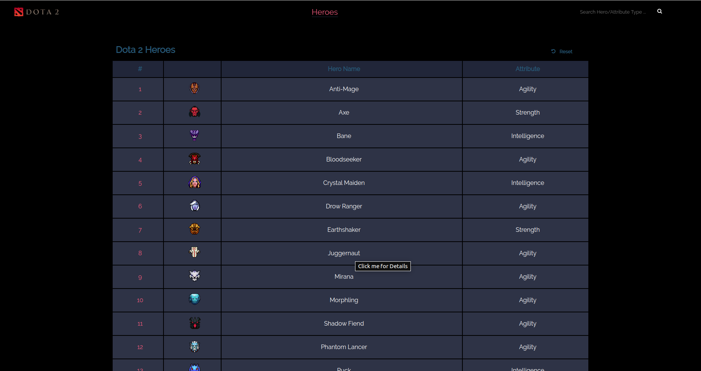
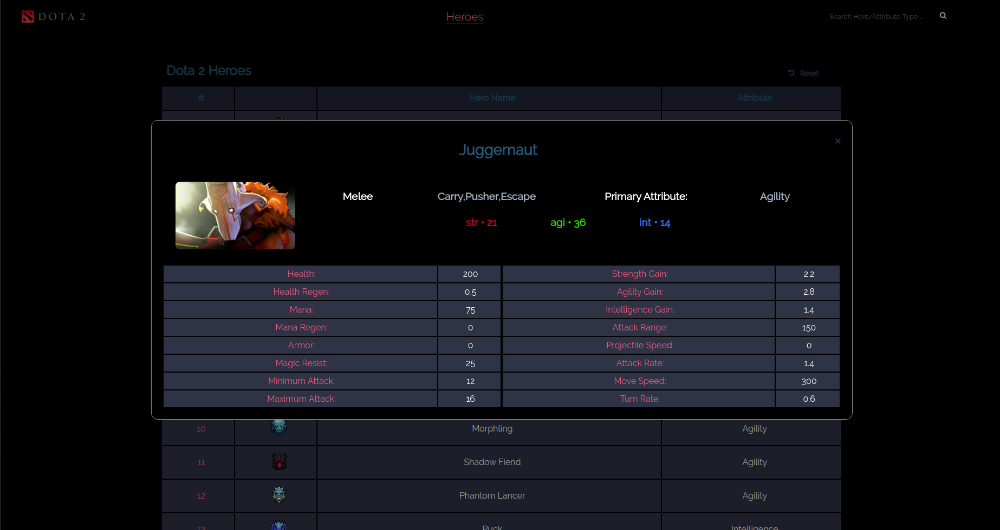

# Welcome to Dota 2 Heroes and Player Info API!  
  
Dota 2 Heroes and Player Info Api shows all the heroes and players stats in DotA 2. You can also search the hero by name or by primary attribute.
All the data are from <a href="[https://docs.opendota.com/](https://docs.opendota.com/)"> OpenDota API</a> managed by <a href="[https://www.opendota.com/](https://www.opendota.com/)">OpenDota - Dota 2 Statistics</a>.
# Requirements  
  

 - Internet Connection `to be able to load and fetch the API`
 - Browser *(recommended: Google Chrome and Mozilla Firefox)*

  
## List of Dota 2 Heroes
  
  Once you open the index, it automatically shows all the heroes of Dota 2 (*alphabetically*)
  
## Search Dota 2 Heroes
  
The Search Bar is located at the top right of the page. 

By typing and pressing the search button or the enter button, you can search a hero by its name or by its primary attribute `Strength, Agility and Intelligence`. 
  
## Dota 2 Hero details  
  
You can find all the base stats of the hero by clicking the name in the list of heroes.

## Reset Hero List

In order to return the list into the default. The User needed to click the reset button at the upper right of the table.

## Player Info 

By clicking the Player link in the navigation bar, the user can search the player information and recent matches by searching the steam id or account id.

*example ID: 135077859*

## Built With

 - <a href="https://jquery.com/">jQuery</a>
 - <a href="https://stephanwagner.me/jBox/" title="jQuery alert plugin">jBox </a>
 - <a href="https://api.opendota.com/api">OpenDota API</a>
